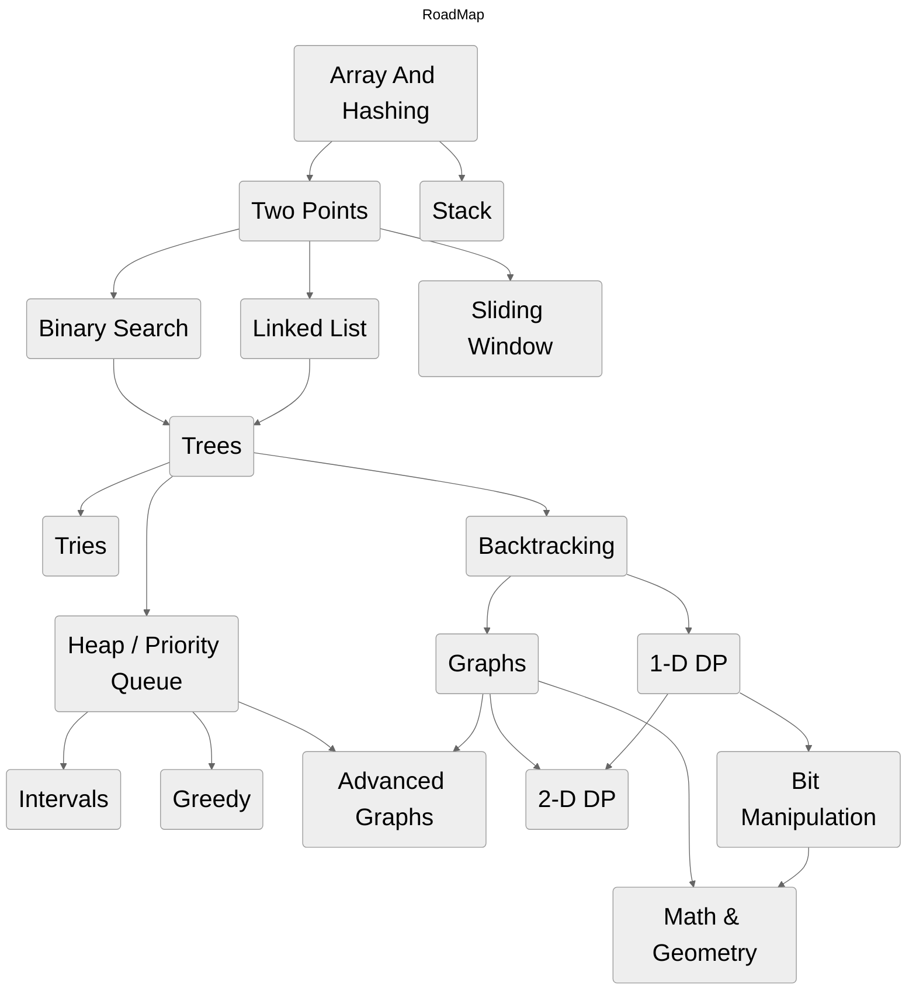

# leetcode

这个仓库用来存放我的 leetcode 刷题记录

刷题的顺序按照 [Neetcode](https://neetcode.io/roadmap)

```mermaid
---
title: RoadMap
config:
  theme: neutral
  themeVariables:
    fontSize: 30px
---
flowchart TD
nodeArray(Array And Hashing)
node2Point(Two Points)
nodeStack(Stack)
nodeBinarySearch(Binary Search)
nodeLinkedList(Linked List)
nodeSlidingWindow(Sliding Window)

nodeTrees(Trees)
nodeTries(Tries)
nodeHeap(Heap / Priority Queue)
nodeBacktracking(Backtracking)

nodeIntervals(Intervals)
nodeGreedy(Greedy)

nodeADGraphs(Advanced Graphs)
nodeGraphs(Graphs)

nodeDP1D(1-D DP)
nodeDP2D(2-D DP)

nodeBit(Bit Manipulation)
nodeMath(Math & Geometry)

nodeArray --> node2Point
nodeArray --> nodeStack

node2Point --> nodeBinarySearch
node2Point --> nodeLinkedList
node2Point --> nodeSlidingWindow

nodeBinarySearch --> nodeTrees

nodeLinkedList --> nodeTrees

nodeTrees --> nodeTries
nodeTrees --> nodeHeap
nodeTrees --> nodeBacktracking

nodeHeap --> nodeIntervals
nodeHeap --> nodeGreedy
nodeHeap --> nodeADGraphs

nodeBacktracking --> nodeGraphs
nodeBacktracking --> nodeDP1D

nodeGraphs --> nodeMath
nodeGraphs --> nodeDP2D
nodeGraphs --> nodeADGraphs

nodeDP1D --> nodeDP2D
nodeDP1D --> nodeBit

nodeBit --> nodeMath

```
